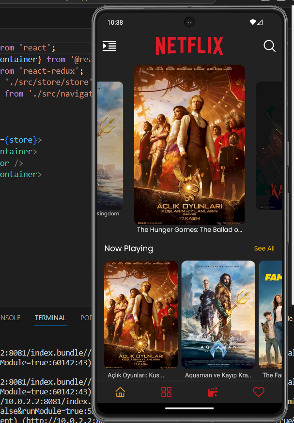

# movieApp

MovieApp:
MovieApp, kullanıcıların sinema dünyasını keşfetmelerini ve filmlerle ilgili en güncel bilgilere erişmelerini sağlayan bir film uygulamasıdır. TMDB API'si üzerinden veri çekerek kullanıcıların filmlerin listelendiği bu filmlerin detayına ulaşabildikleri ve film fragmanını izleyebildikleri ayrıca beğenebilecekleri, izleyebilecekleri filmlerin listesini oluşturabilecekleri geniş bir film koleksiyonunu sunar.
Ana Ekran:
Uygulamanın ana ekranında, kullanıcılar için dört ana bölüm bulunur:
Trendler: Şu an popüler olan filmler burada listelenir.
Popüler Filmler: Genel olarak popüler olan filmler bu bölümde gösterilir.
Gelecek Filmler: Yakında vizyona girecek olan filmler burada yer alır.
Oynatılan Filmler: Şu anda gösterimde olan filmlerin listesi bu sekmede sunulur.
Kategori Ekranı:
Film türlerine göre kategorilendirilmiş filmler bu ekranda bulunur.
İzleme Listesi Ekranı:
Kullanıcıların izlemek istedikleri filmleri kaydedebilecekleri ve izleme listesine ekleyebilecekleri bir bölüm. Aynı zamanda izleme listesinden film kaldırma özelliği mevcuttur.
Favori Listesi Ekranı:
Kullanıcıların favori filmlerini listeleyebilecekleri bir bölüm. Buradan favori filmleri yönetmek ve listeden kaldırmak mümkündür.
Arama Ekranı:
Filmleri isim, oyuncu veya tür bazında arayabileceğiniz bir alan. Arama sonuçları film fragmanlarını izleme, favorilere ekleme, izleme listesine ekleme ve filmin detaylarına ulaşma imkanı sunar.
Detay Ekranı:
Herhangi bir film üzerine tıkladığınızda açılan detay ekranı. Burada filmin özeti, türü, puanı, izlenme sayısı ve oyuncu kadrosu bulunur. Ayrıca, filmle ilgili benzer öneriler, film posterleri ve kullanıcı yorumları da burada yer alır. Oyuncu detayları da ayrı bir screen de yapılandırılmıştır.

## Preview

# movieApp_React-Native
